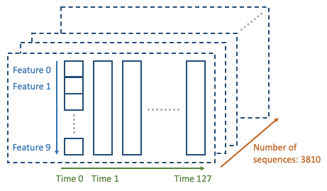

# Simple demo of a Transformer encoder implementation in TensorFlow

This project demonstrates how to use a Transformer encoder to do multivariate sequence classification.

For this demonstration, a public dataset from Kaggle is used: [CareerCon 2019 - Help Navigate Robots](https://www.kaggle.com/c/career-con-2019/data)

## The dataset

This dataset is from the 2019 CareerCon. It contains data from IMU (Inertial Measurement Units) sensors on robots. The goal is to predict the floor surface based on this timeseries data. There are 9 floor types (carpet, tiles, concrete, etc.), so this is a sequence classification problem. The input data consists of a timeseries, where we have the IMU data at each of the 128 time steps. There are 10 features recorded by the sensor, such as velocity, acceleration, and orientation.

## Preparations

Make sure you can run Python and install all dependencies, including TensorFlow.

```
pip install -r requirements.txt
```

## Download dataset

For downloading the dataset, there are three options:

Option 1:
Download the dataset via web browser. Head over to the [Kaggle dataset site](https://www.kaggle.com/c/career-con-2019/data), make sure you are logged in, and
click on "Download All". Unpack the zip file to `./career-con-2019/`.

Option 2:
Download the dataset with Python. First you need a Kaggle API key: On the [Kaggle](https://www.kaggle.com/) webpage, go to your user settings, and click "Create New Token". Store the downloaded JSON file as `./kaggle.json`. Then run [download_dataset.py](download_dataset.py):

```
python download_dataset.py
```
  
This will automatically find your API key file and download the dataset to `./career-con-2019/`.

Option 3:
Download the dataset from this third party link: [Google Drive link](https://drive.google.com/file/d/1tn5438OZFClGa0bcf2_bFxUOCtMNR-I0/view?usp=sharing).
Unpack the dataset to `./career-con-2019/`.


## Preprocess dataset

The dataset you downloaded contains raw CSV files. For our Transformer model training, we need to do some preprocessing and bring all data into `numpy` array format. Moreover, we need to normalize the numerical features.

Run [preprocess_dataset.py](preprocess_dataset.py) to create the numpy dataset `./dataset_career_con_2019.npz`, which will serve as training data for the Transformer model:

```
python preprocess_dataset.py
```

Optionally, you can run [analyze_dataset.ipynb](analyze_dataset.ipynb) to do some dataset analysis. As part of this script, you'll be able to look at a randomly picked time series, after normalization:


The result of preprocessing is a 3d numpy dataset:



As shown in the above picture, the 3 dimensions of the dataset are:
- The sequence ID (there are 3810 sequences in total)
- The temporal dimension (there are 128 time steps)
- The feature vector (there are 10 features)

## Transformer encoder training

The Transformer encoder is implemented as `TransformerEncoder` class in [transformer_classifier.py](transformer_classifier.py). You can have a look at the implementation. Everything from token embedding, multi-head attention to the final classification head is contained in this class.

Now everything is ready to train the Transformer encoder. Simply run the Python Notebook [transformer_training.ipynb](transformer_training.ipynb). This notebook uses the `TransformerEncoder` class under the hood to train the Transformer model from scratch, on a sequence classification task. 

If everything goes well, you should see the training and testing progress similar to this:


Note that the final test accuracy is only around 55%, so there's big room for improvement. A thorough hyper parameter search and longer, slower training will yield significantly better results. As a final note, good ML practice mandates to perform hyper parameter tuning on a validation dataset, not on the test dataset.

## Transformer encoder architecture

Here is a short description of the transfomer neural network you just used. The overall architecture looks as follows:


In the above picture, the blue part in the lower half is the standard encoder also used in the [BERT paper](https://arxiv.org/abs/1810.04805).
The upper half shown in green is the classification head, applied to the final [CLS] token representation.

In short, the overall architecture looks as follows:
- Each input is a sequence of shape (number of timesteps, number of features). Note that in reality, we use batching, so then one dimension gets added, which is the batch size.
- We prepend each sequence by the [CLS] token.
- Next, we learn an embedding for the feature vectors. In this step, the raw feature vector of each time step gets linearly transformed into a lower dimension.
- As a next step, we add positional encoding. This is a fix encoding, and gives the Transformer a hint as to the relative position of each token in the sequence.
- Next, all embedded tokens are passed through the encoder stack. Each encoder layer has six sublayers: a multi-head attentino layer, layer normalization, a residual connection, a small feedforward neural network, a layer normalization, and finally another residual connection.
- A classification head is added on top of the final [CLS] token representation. The classification head is a small feed forward neural network.
- Finally, a softmax is applied to get the probability score for each of the 9 floor types.